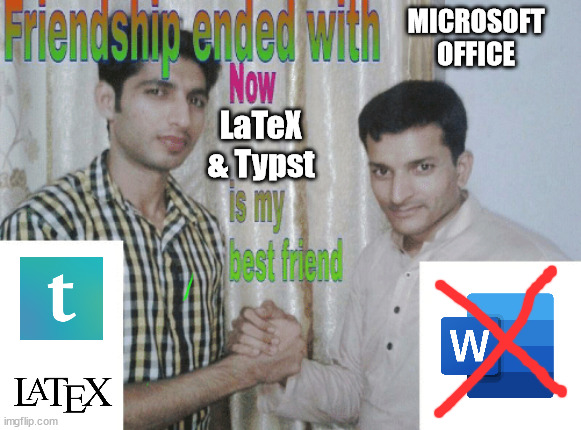

# Bachelor Electrical Engineering :zap:


> [!NOTE]
> This repo is archived and won't be touched for any time soon (additionally I also got my bachelor degree). I'm moving slowly over to [Codeberg](https://codeberg.org/) and live there for the time being. 
>
> **Why?** Because what Microsoft is doing for the sake of growth is just not my thing. I'm all for open access to information, but not in a form of a probability matrice turning natural language into AI slop. This is not _old guy yelling at cloud_, it's more _young guy too tired thinking about how creators' works gets turned into an abusive relationship between a mega corporation and people thinking that their [productivity "improves"](https://arxiv.org/abs/2507.09089) or "they can finally relax"_ (that's not how today's capitalism works, probably). We will never not work, despite developing tools that help us do boring stuff easier.
> 
> But what happens when we can skip the boring parts of our work? Does the work we enjoy turn into the boring work? If we get to eat cake everyday and skipping the "boring food", don't we start to hate cake at some point?
>
> I wanna see people create stuff instead of relying on those excessive energy consuming and cognitive debt creating software/tools. Also let's not forget, that the best way to acquire money is to:
> 1.  Give away a nice tool, which can't be used offline, to consumers
> 2.  Get the consumers hooked on those tools (as in they need to rely on those)
> 3.  Introduce a subscription model (and keep the free tier)
> 4.  Slowly introduce new features or move features from the free tier to the subscription model
> 5.  Jack up the price until the CEOs' balls explodes
>     - Consumers watch how billionaires fly with 90 fucking private jets to Venice and have the most goddamn, out of touch wedding the world has ever seen.
>     - Billionaires are not people we should respect. They don't earn money to help us (they would have done that a long time ago and in a much fairer way like improving fair competitivness) 

> What you can do:
> - Be a little bit sceptical about things coming out of Silicon Valley (or from any person who does not have a full degree in the product they sell)
> - Care about your family and friends and give something to the local community. Money is not everything to live for. Go play board games with friends or learn how to rock climb. Punch all the Nazis. Spit on billionaires, they probably do they same to us (metaphorically).
> - Also, read about the positive developments in AI! Like detecting cancer cells or helping people with speech disabilites be able to talk again. This is really freaking cool and at least something worth.
> - Care about your digital identity how you care about your real identity.

---

Hello Dweller of Github or StudentBox User or curious friends that I've sent the summary to.

This repository contains summaries and some lab reports written in Latex, Quarto and Typst. The majority of the summaries are written using [Quarto](https://quarto.org/) and has been extended with some Latex templates. The last summaries were written using [Typst](https://typst.app/home/).

> ***Why Quarto (& Typst) and not Office Word?***<br>
> I've found Latex to be really powerful for thesis and documentations and gives off a consistent style! Quarto solves the learning curve of Latex for me, by replacing the language by rMarkdown. 
> 
> Newer tools such as Typst have emerged, which I've used for the final semester summaries. It's a cool tool and I'm thinking about using it for my future masters degree. It has (almost) instant compilation and thus allows for live previewing it. It has an easier programmer approach, than the other tools.

<center>
  
</center>

## Lovely Contributors

The peeps below have helped me out a lot with writing the summaries and without them I probably wouldn't be able to write the majority of them!

|<br /><a href="https://github.com/threaming">threaming</a>|<br /><a href="https://github.com/manuelfanger">manuelfanger</a>|
|:-------------------------------------------------------------------------------------------------------------------------:|:----------------------------------------------------------------------------------------------------------------------------:|

## Compiling it yourself using Quarto

> [!WARNING]
> This will not work with Typst based documents. For those either use the [typst-cli](https://github.com/typst/typst) or the version of it [typst.app](https://typst.app/).

If you want to compile the documents for yourself, in the following steps I will try to explain the installation process.

> If you found something horribly wrong or some critical changes, then either inform me or create a pull request. Keeping it correct is the way to go!

### Install Quarto

Quarto is the crux of this whole matter. It handles all the building and rendering of the documents. It has a mild learning curve though.

- Open up the [Getting Started](https://quarto.org/docs/get-started/)-Page of Quarto and download the respective installer.
- Install Quarto

### Install the TinyTex Distribution

The template is Latex based and therefore you'd need to install a Latex distribution, if you haven't already. I'm currently using TinyTex, which can be installed via Quarto.

- If you don't have a distribution installed, following installs TinyTex

```bash
quarto install tinytex --update-path
```

**Neat to know**: If you have a TexLive based distribution, Quarto **automatically** installs missing packages!

### Install Visual Studio Code

- [Download](https://code.visualstudio.com/) & install Visual Studio Code
- Install Extensions
  - [Quarto](https://marketplace.visualstudio.com/items?itemName=quarto.quarto)
  - [Markdown All in One](https://marketplace.visualstudio.com/items?itemName=yzhang.markdown-all-in-one)
  - [R](https://marketplace.visualstudio.com/items?itemName=REditorSupport.r)


### Alternative: Install RStudio

RStudio is neat, as its integration is much better than VSCode's, but lacks the customization (or easy access to change the customizations).

- [Download](https://posit.co/products/open-source/rstudio/) & install RStudio instead of Visual Studio Code

### Open up a Summary

Open up any folder and open up the respective `main_*.qmd`-file and hit the render/compile button.

Good Luck!

## `cmbright`

When using the TinyTex-Distribution (which is just a smaller TexLive with less packages), the `cmbright` package doesn't work with specific configuration (I think it has something to do with the `multicol` package), giving out an auto expansion error.

What worked for me was to install following packages manually...

- `cm-super`
- `fontspec`
- `hfbright`


..., run `updmap` in the terminal and afterwards set the quarto-setting in the document.

```bash
tlmgr.bat install cm-super cmbright fontspec hfbright
updmap
```

It does give a nicer text body (using CM Bright Light) and feels nice to look at.
