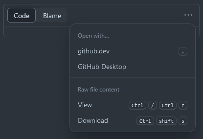

# Bachelor Electrical Engineering :zap:

Hello Dweller of Github or Studentbox User (or curious friends that I've sent the summary to)

This repository contains summaries and some lab reports written both in Latex & Quarto. The majority of the summaries is written using [Quarto](https://quarto.org/) and has been extended with some Latex templates.

> ***Why Quarto and not Office Word?***<br>
> When working with multiple people on one document, Word at some point struggles or just straight up dies, as its collaboration tools have been (probably) ducktaped on top of Word. And well Latex documents look cool :)

## Lovely Contributors

The peeps below have helped me out a lot with writing the summaries and without them I probably wouldn't be able to write the majority of the summaries!

|<br /><a href="https://github.com/AndreasMing">AndreasMing</a>|<br /><a href="https://github.com/manuelfanger">manuelfanger</a>|
|:-------------------------------------------------------------------------------------------------------------------------:|:----------------------------------------------------------------------------------------------------------------------------:|

## Hello Joel, I would like to use your template or make my own changes to your existing documents, but I don't know how to setup my environment. Could you help me?

Yes! So first of all, if there are major flaws in the summaries, either make an issue or edit the respective document on your own and create a pull/merge request. &rarr; this way there aren't multiple versions of the summaries.

> I might also create a HSLU student organization, that contains the summaries' source files. But don't know when I get to it.

Second, I'll show you how to setup the environment. My main workflow has been with Visual Studio Code and the TinyTex- distribution.

### Install Quarto

Quarto is the crux of this whole matter. It handles all the building and rendering of the documents. It has a mild learning curve though.

- Open up the [Getting Started](https://quarto.org/docs/get-started/)-Page of Quarto and download the respective installer.
- Install Quarto

### Install the TinyTex Distribution

The template is Latex based and therefore you'd need to install a Latex distribution, if you haven't already. I'm currently using TinyTex, which can be installed via Quarto.

- If you don't have a distribution installed, following installs TinyTex

```bash
quarto install tinytex --update-path
```

**Neat to know**: If you have a TexLive based distribution, Quarto **automatically** installs missing packages!

### Install Visual Studio Code

- [Download](https://code.visualstudio.com/) & install Visual Studio Code
- Install Extensions
  - [Quarto](https://marketplace.visualstudio.com/items?itemName=quarto.quarto)
  - [Markdown All in One](https://marketplace.visualstudio.com/items?itemName=yzhang.markdown-all-in-one)
  - [R](https://marketplace.visualstudio.com/items?itemName=REditorSupport.r)


### Alternative: Install RStudio

RStudio is neat, as its integration is much better than VSCode's, but lacks the customization (or easy access to change the customizations).

- [Download](https://posit.co/products/open-source/rstudio/) & install RStudio instead of Visual Studio Code

### Download Template

- Open up the folder, where the template is located: 
  - **Main** &rarr; template &rarr; summary
  - [Link](https://github.com/joelvonrotz/bachelor-electrical-engineering/blob/main/template/summary/Template_v1.zip)
- Download the zipped template &rarr; click on it and click download

- Extract the ZIP file &rarr; This is your workspace for **one** document
- Open up the template in Visual Studio Code

### Use Template

- `main_document.qmd` contains the most important information about the document, such as the title, author, etc.
- Inside `config/config.tex` you can change the footer and header contents &rarr; at Line 35-47
- `config/before-body.tex` you can change the title page


Good Luck!


